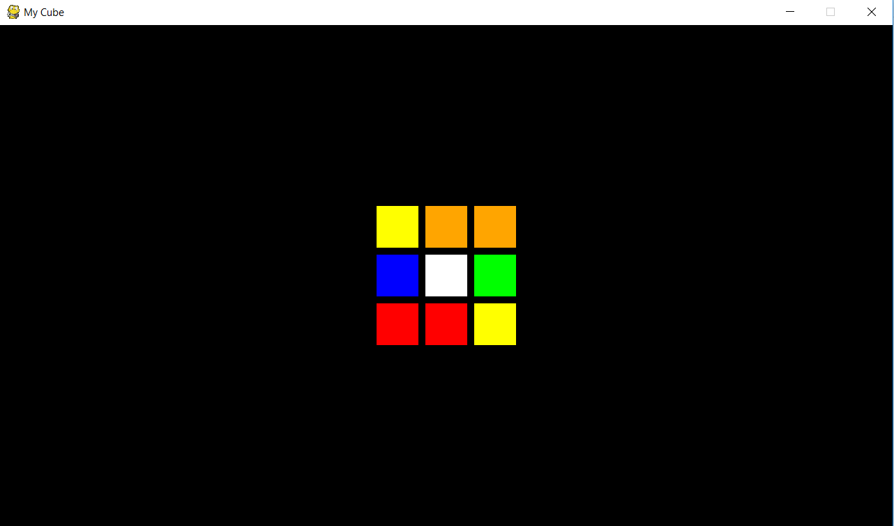

# 3x3cube
This project is coded in Python 3.6+.
A project inspired by the well-known 3x3 Rubik's Cube.

Requirements: Python 3.6+, pygame module

Instructions: 
1) run rubiks_cube_gui.py
2) Use arrow keys for rotation of the whole cube
3) Use F ,B ,L ,R ,U ,D keys for rotation of individual faces (shift + key for inverse rotation)

The aim of this project is to build an appropriate representation for the Rubik's Cube such that further extensions,
such as a solver AI, can be made for the purposes of learning or trying out cubing on the computer.
This project makes use of functional and object-oriented programming.

Current features include:
1) Working GUI for default rubik's cube

2) Generator for a (guaranteed solvable) custom 3x3 cube with non-standard stickers using user input

3) Working coordinate system based representation of a cube with face rotation and perspective rotation support

4) printcube / get_state methods which output a text-based representation of the current state of the cube

Further improvements/ideas:

1) Complete the alternative 2D array representation (rubiks_cube_alternative.py).

2) Additional functionalities - cube randomizer (using random module), cube solver

Thank you for reading and have a nice day!
